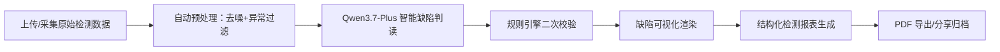

## 1. 产品概述

混凝土内部缺陷检测智能分析平台——面向建筑工程质检领域的Web端专业智能应用，集成异常数据过滤、缺陷智能识别、检测报表自动生成与多维度可视化展示，核心分析能力基于阿里云百炼平台 Qwen3.7-Plus 大模型驱动。目标是替代传统人工判读流程，提升混凝土构件（超声/探地雷达/X射线等）内部缺陷检测的效率、准确性与可追溯性。

## 2. 核心功能

### 2.1 用户角色

| 角色 | 注册方式 | 核心权限 |
|------|----------|----------|
| 检测工程师 | 邮箱注册/单租户企业登录 | 上传检测数据、发起AI分析、查看/导出自己的报表 |
| 项目负责人 | 同检测工程师 | 额外可查看同项目下全部检测记录、批量报表导出 |
| 系统管理员 | 管理员账号初始化 | 管理项目、用户、知识库参数 |

*MVP 阶段仅以"检测工程师"角色作为完整主流程演示，角色权限在数据层通过 projectId 隔离展示效果*

### 2.2 功能模块与页面

1. **总览驾驶舱**：检测任务总览、关键KPI卡片、近期缺陷趋势、设备运行概览
2. **数据采集管理**：检测项目列表、单条检测任务详情、原始曲线预览、异常数据标记
3. **AI 智能分析**：数据预处理/异常过滤、Qwen3.7-Plus 缺陷智能判读、缺陷级别标定、定位标注
4. **缺陷可视化**：3D 构件切片示意、缺陷热力图、波速/振幅分布图、时间/空间分布图表
5. **检测报表中心**：PDF 预览、结构化检测报告生成、批量导出、历史报告检索
6. **系统设置**：知识库阈值配置、模型参数调优、审计日志

### 2.3 页面详情

| 页面名称 | 模块名称 | 功能描述 |
|----------|----------|----------|
| 总览驾驶舱 | KPI 卡片 | 今日检测数、待分析样本、缺陷检出率、平均置信度 |
| 总览驾驶舱 | 趋势图 | 近 30 天缺陷级别分布、材料类型分布 |
| 数据采集 | 项目列表 | 项目筛选、构件类型、设备来源、状态 |
| 数据采集 | 任务详情 | 原始检测波形折线预览、异常点手动标注 |
| AI 分析 | 预处理 | 自动去噪、异常点过滤、信噪比评估 |
| AI 分析 | 智能判读 | Qwen 多模态输入 + 规则引擎融合输出（缺陷位置/类型/置信度/建议） |
| 缺陷可视化 | 3D 构件切片 | 按检测深度切面渲染缺陷气泡区 |
| 缺陷可视化 | 热力图 | 检测面 x/y 平面缺陷强度叠加 |
| 检测报表 | 报告生成 | 自动填充构件信息、检测方法、缺陷列表、结论与建议 |
| 检测报表 | 导出 | PDF 预览 / 一键下载 / 分享链接 |
| 设置 | 阈值库 | 不同强度等级混凝土的波速/振幅/回波阈值管理 |
| 设置 | 审计日志 | 全部分析事件记录，不可篡改 |

## 3. 核心流程

用户主流程：工程师进入项目 → 上传某构件检测原始文件（或选择模拟数据） → 系统自动预处理（异常点标红/滤除） → 一键调用 Qwen3.7-Plus 智能分析 → 查看缺陷位置+类型+严重级别+修复建议 → 在可视化面板中核对 → 生成并下载 PDF 检测报告。

## 4. 用户界面设计

### 4.1 设计风格

- **主色**：深蓝钢灰 `#0F2837`，辅助科技青 `#16A085`，警示琥珀 `#F39C12`，危险红 `#C0392B`
- **按钮**：方形大圆角 (rounded-xl)，实线描边 + 悬浮微抬升，主按钮带渐变高光
- **字体**：标题用 "JetBrains Mono"（等宽科技感），正文用 "IBM Plex Sans SC"（中文现代无衬线）
- **布局**：左侧 240px 深色导航 + 顶部工具条 + 主区卡片化栅格（12 栅格）
- **图标**：lucide-react，统一线宽 2px；状态小胶囊用 SVG 小圆点
- **氛围**：深色工业基调 + 青蓝高光描边 + 网格背景纹理，营造专业质检中心氛围

### 4.2 页面设计概览

| 页面名称 | 模块名称 | UI 元素 |
|----------|----------|----------|
| 总览驾驶舱 | Hero | 深色背景 + 细网格纹理；KPI 大数字等宽字体 + 微动效 |
| 数据采集 | 列表/详情 | 左侧列表 + 右侧波形图（Canvas 折线）；悬停高亮 |
| AI 分析 | 工作台 | 双栏：原始波形（带标注）/右侧 AI 对话流（Qwen 流式输出） |
| 缺陷可视化 | 图表 | Canvas/SVG 渲染 3D 切面、热力图、柱状分布 |
| 检测报表 | 报告 | 打印友好白色卡片，标题大衬线，正文等宽数据 |
| 设置 | 表单 | 带校验的阈值滑块 + 审计日志表格 |

### 4.3 响应式

桌面优先（≥1280px 主布局），≥1440px 增加侧边栏数据抽屉；移动端降级为 Tab + 单栏，关键图表保持可交互。

## 5. 安全与数据

- 所有检测数据本地/企业侧存储，不出域；大模型仅接收摘要化信号特征
- API Key 环境变量注入，前端仅走代理
- 审计日志不可变（追加写、SHA 校验）
- 导出 PDF 带水印：项目编号、检测人、时间戳
