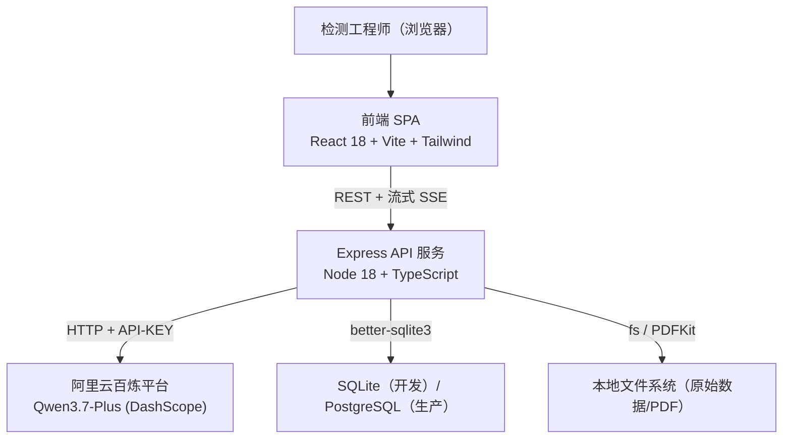
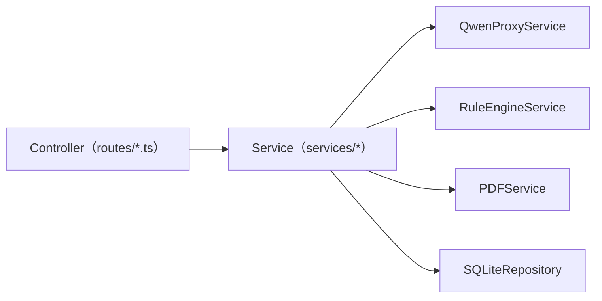
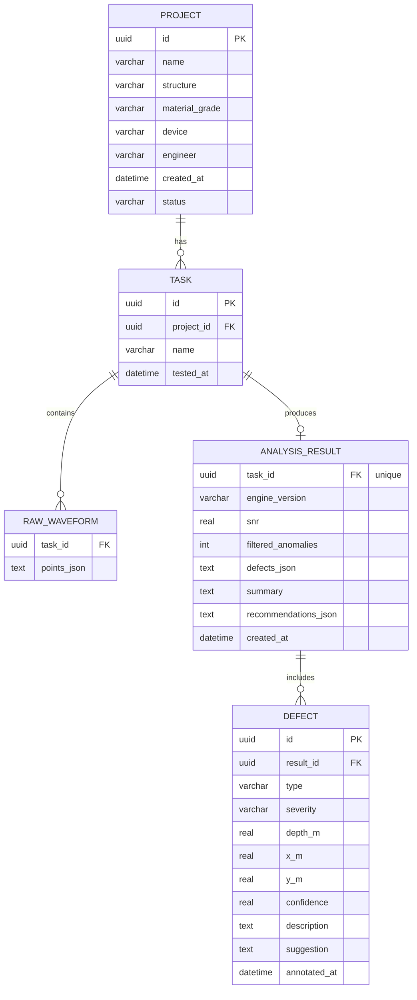

## 1. 架构设计



分层：
- **前端层**：React + Vite，负责交互、可视化、PDF 预览
- **API 层**：Express 处理鉴权、业务编排、大模型代理、PDF 生成、审计日志
- **大模型层**：阿里云百炼 DashScope OpenAI 兼容接口，调用 `qwen-plus`（按用户要求的 Qwen3.7-Plus 映射到百炼现有 `qwen-plus` 模型标识）
- **数据层**：SQLite 本地库 + 本地文件存储
- **模拟层**：开发模式前端直接内置 JSON 模拟数据（零依赖即可演示）

## 2. 技术栈

- 前端：React@18 + TypeScript + Vite@5 + TailwindCSS@3 + Zustand + react-router-dom + recharts + lucide-react
- 后端：Express@4 + TypeScript + better-sqlite3 + pdfkit + cors + dotenv
- 初始化：`npm init vite-init@latest -y . "--" --template react-express-ts --force`
- 大模型 SDK：`@dashscope/sdk`（或 `openai` 包走 DashScope OpenAI 兼容网关）

## 3. 路由定义

### 前端路由

| 路由 | 用途 |
|------|------|
| / | 总览驾驶舱 |
| /acquisition | 数据采集项目列表 |
| /acquisition/:id | 单项目检测任务详情 |
| /analysis/:id | AI 智能分析工作台 |
| /visualize/:id | 缺陷多维度可视化 |
| /reports | 检测报表中心 |
| /settings | 系统设置 |

### 后端路由（Express）

| 方法 | 路由 | 用途 |
|------|------|------|
| GET | /api/projects | 项目列表（支持筛选） |
| GET | /api/projects/:id | 项目详情 + 检测任务 |
| POST | /api/projects | 新建项目 |
| POST | /api/tasks | 新建检测任务 |
| GET | /api/tasks/:id/raw | 原始波形数据 |
| POST | /api/tasks/:id/preprocess | 去噪 + 异常过滤 |
| POST | /api/tasks/:id/analyze | 调用 Qwen3.7-Plus 智能判读（SSE 流式） |
| GET | /api/tasks/:id/result | 获取完整分析结果 |
| POST | /api/tasks/:id/report | 生成 PDF 报告（pdfkit） |
| GET | /api/tasks/:id/report.pdf | 直接下载 PDF |
| GET | /api/kpi/summary | 驾驶舱 KPI 汇总 |
| GET | /api/kpi/trend | 近 30 天趋势 |
| GET | /api/settings/thresholds | 阈值库 |
| PUT | /api/settings/thresholds | 更新阈值 |
| GET | /api/audit | 审计日志 |

## 4. API 数据定义

```ts
type DefectType = 'honeycomb' | 'crack' | 'void' | 'delamination' | 'segregation'
type Severity = 'low' | 'medium' | 'high' | 'critical'

interface Defect {
  id: string
  taskId: string
  type: DefectType
  severity: Severity
  depth_m: number
  x_m: number
  y_m: number
  confidence: number // 0..1
  description: string
  suggestion: string
  annotatedAt: string
}

interface Project {
  id: string
  name: string
  structure: string
  materialGrade: string // 如 C30 / C40
  device: 'ultrasound' | 'gpr' | 'xray'
  engineer: string
  createdAt: string
  status: 'draft' | 'testing' | 'analyzed' | 'reported'
}

interface RawWaveform {
  taskId: string
  points: Array<{ t_ms: number; amp: number; v_ms: number; abnormal?: boolean }>
  unit: string
}

interface AnalysisResult {
  taskId: string
  engineVersion: string // qwen-plus + rule-engine v1.0
  createdAt: string
  snr: number
  filteredAnomalies: number
  defects: Defect[]
  summary: string
  recommendations: string[]
}
```

## 5. 服务器架构



- **QwenProxyService**：将摘要化特征（波形统计 + 预处理 JSON）组装成结构化 Prompt → 调用 DashScope `qwen-plus` → 解析 JSON 回复（若失败回退规则引擎）
- **RuleEngineService**：基于阈值库（波速/振幅/回波时间）的确定性判读，用作兜底和二次校验
- **PDFService**：pdfkit 生成标准 GBT 50107 风格检测报告
- **SQLiteRepository**：统一数据访问

## 6. 数据模型



## 7. 部署与演示说明

- **开发演示**：默认走前端内置的 mock 数据，零后端、零 API Key 即可完整展示；
- **真实接入**：配置 `.env` 的 `DASHSCOPE_API_KEY`、后端 `USE_QWEN=true` 后自动切真实模型；
- **PDF 报告**：Express 通过 pdfkit 生成，带水印；
- **审计日志**：SQLite 表 `audit_log(id,actor,action,target,meta_json,ts,hash)` 追加写 + SHA256 前置校验。
